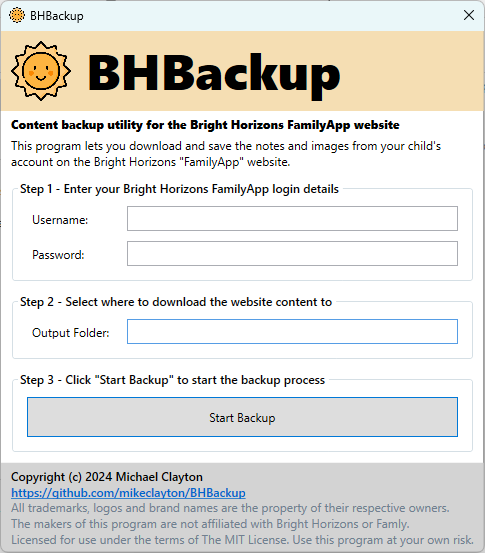

# BHBackup - Bright Horizons FamilyApp website backup utility



## Overview

This program lets you download and save the notes and images from your
child's account on the Bright Horizons "FamilyApp" website.

**To install:**

* Download the latest version of the program to your computer from <a href="https://github.com/mikeclayton/BHBackup/releases">here</a>.

* Find the ```BHBackup-gui-win-x64.exe``` program in your Downloads folder.

* On Windows computers you *may* need to "unblock" the file to allow it to run - right click it, select "Properties" (or "Show more options" and *then* "Properties") and in the pop-up dialog tick the "Unblock" checkbox and click "OK".

**To use:**

* Double-click ```BHBackup-gui-win-x64.exe``` to launch it - you'll see window like the one at the top of this page.

* Enter your username and password that you normally use to log into the Bright Horizons FamilyApp website.

* Enter the name of folder you want to create the backup in.

* Click the "Start Backup" button.

* The program will make an offline copy of some parts of your child's account, including all the posts and images "Newsfeed" and "Notes" pages and will build an offline website you can keep and access even after your child leaves the nursery.

## Disclaimers

* I'm not affiliated with Bright Horizons or Famly - I'm just a parent who wrote a utility to let me download a copy of the notes and photos posted to the app that my daughter's nursery uses to share pictures during the school day because, strangely, the app doesn't let me do that natively, and I really want to keep a copy of all the photos and notes when my child leaves the nursery.

* All trademarks, logos and brand names are the property of their respective owners. The makers of this program are not affiliated with Bright Horizons or Famly.

* I also don't provide any warranty for this FREE software, or make any claims about its suitability for any particular purpose. If you decide to use this program, you agree to do so at your own risk - see the License section below for more details.

* In particular, please don't *rely* on this utility working at any time, and make sure you take *other* backups of your child's data stored in the Family App website by different means. Aside from any bugs and defects that might be present in this utility, the Family App website could be updated at any time in a way that completely breaks this utility.

## License

This software is licensed under <a href="https://opensource.org/license/mit">The MIT license</a>:

**Copyright 2024 Michael Clayton**

Permission is hereby granted, free of charge, to any person obtaining a copy of this software and associated documentation files (the “Software”), to deal in the Software without restriction, including without limitation the rights to use, copy, modify, merge, publish, distribute, sublicense, and/or sell copies of the Software, and to permit persons to whom the Software is furnished to do so, subject to the following conditions:

The above copyright notice and this permission notice shall be included in all copies or substantial portions of the Software.

THE SOFTWARE IS PROVIDED “AS IS”, WITHOUT WARRANTY OF ANY KIND, EXPRESS OR IMPLIED, INCLUDING BUT NOT LIMITED TO THE WARRANTIES OF MERCHANTABILITY, FITNESS FOR A PARTICULAR PURPOSE AND NONINFRINGEMENT. IN NO EVENT SHALL THE AUTHORS OR COPYRIGHT HOLDERS BE LIABLE FOR ANY CLAIM, DAMAGES OR OTHER LIABILITY, WHETHER IN AN ACTION OF CONTRACT, TORT OR OTHERWISE, ARISING FROM, OUT OF OR IN CONNECTION WITH THE SOFTWARE OR THE USE OR OTHER DEALINGS IN THE SOFTWARE.

## Support

I imagine there's lots of other parents who would want to be able to use this utility, so I've open-sourced it, but please remember this isn't a commercial product - I wrote it in my spare time and I'm making it available for **FREE** to anyone who agrees to the terms of the license above.

If you have problems running it or you get error messages, or something just doesn't seem quite right, please feel free to create an "Issue" (see the links in the menu at the very top of this page) with details of the problem and I'll do what I can to help, but I *can't* make any promises that I'll have either the time or the ability to fix it.

## Attribution

* Sun icon - <a href="https://www.flaticon.com/free-icon/sun_3050031" title="sun icons" target="_blank">Sun icons created by Freepik - Flaticon</a>
* Message box icon - <a href="http://sixrevisions.com/freebies/icons/free-icons-candy-ui-icon-set/" target="_blank">Candy UI Icon Set</a>
